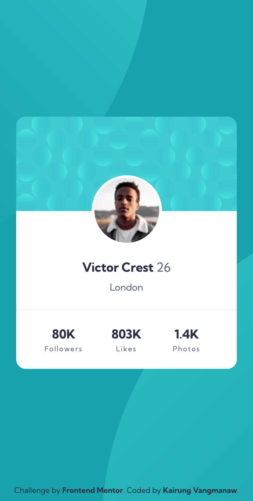
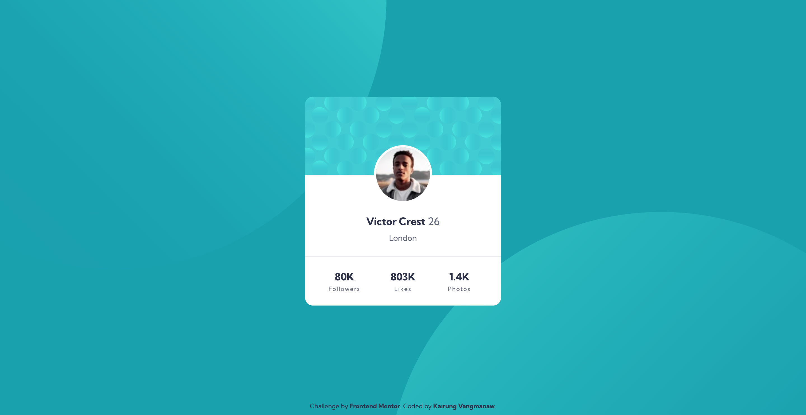

# Frontend Mentor - Profile card component solution

This is a solution to the [Profile card component challenge on Frontend Mentor](https://www.frontendmentor.io/challenges/profile-card-component-cfArpWshJ). Frontend Mentor challenges help you improve your coding skills by building realistic projects. 

## Table of contents

- [Frontend Mentor - Profile card component solution](#frontend-mentor---profile-card-component-solution)
  - [Table of contents](#table-of-contents)
  - [Overview](#overview)
    - [The challenge](#the-challenge)
    - [Screenshot](#screenshot)
    - [Links](#links)
  - [My process](#my-process)
    - [Built with](#built-with)
    - [What I learned](#what-i-learned)
    - [Continued development](#continued-development)
    - [Useful resources](#useful-resources)
    - [AI Collaboration](#ai-collaboration)
  - [Author](#author)
  - [Acknowledgments](#acknowledgments)

## Overview

### The challenge

- Build out the project to the designs provided

### Screenshot

  
Mobile view

  

  
Desktop view

  

### Links

- Solution URL: [Profile Card Component | React, BEM CSS & Accessible HTML](https://www.frontendmentor.io/solutions/test-K8YxS9V1Nj)
- Live Site URL: [Frontend Mentor | Profile card component](https://challenged-by-frontend-mentor.github.io/profile-card-component/)

## My process

### Built with

- [Semantic HTML5 markup](https://developer.mozilla.org/en-US/docs/Glossary/HTML5)
- [CSS Custom Properties](https://developer.mozilla.org/en-US/docs/Web/CSS/Using_CSS_custom_properties) (Variables)
- Flexbox
- [BEM (Block Element Modifier)](https://getbem.com/) CSS architecture
- Mobile-first workflow
- [React](https://react.dev/) - JS Library
- [Vite](https://vitejs.dev/) - Frontend Tooling

### What I learned

- **Decoupling Decorative Backgrounds:** I learned that attaching page-level decorative backgrounds to a card component using `::before` and `::after` tightly couples the page layout to the component. Moving the background patterns to the `body` element using multiple `background-image` layers made the card truly modular and reusable anywhere.

- **Accessibility (a11y) & Semantic Structure:** Instead of using `<h2>` headings for numbers inside stats, I refactored the statistics section into a semantic list (`<ul>` and `<li>`) with `aria-label="User statistics"`. This ensures screen readers announce the data logically without breaking heading hierarchies.

- **Cleaner & Faster Workflow:** By planning the component structure, BEM class names, and responsive layout from the start, my development process became much faster, required fewer fixes, and resulted in cleaner, more maintainable code.

### Continued development

In future projects, I want to continue focusing on Web Accessibility (WCAG standards) to ensure all UI components are fully accessible to screen readers and keyboard users. I also plan to keep refining my CSS architecture and component design practices in React to write even cleaner and more scalable code.

### Useful resources

- [MDN - background-size](https://developer.mozilla.org/en-US/docs/Web/CSS/Reference/Properties/background-size) - This documentation helped me better understand how to properly scale and size background pattern images across different screen viewports.

### AI Collaboration

- **Google Gemini**: Used as a virtual Senior Developer code reviewer to audit accessibility (a11y) standards, evaluate BEM CSS architecture, and refine Semantic HTML structure.
- **Google Search AI Mode**: Used for quick technical references regarding modern CSS layout best practices and web standards.

## Author

- GitHub: [Kairung Vangmanaw](https://github.com/VangmanawKairung)
- Frontend Mentor - [@VangmanawKairung](https://www.frontendmentor.io/profile/VangmanawKairung)

## Acknowledgments

I would like to sincerely thank **myself** for staying persistent and continuously improving, and my **family** for their constant support and encouragement. Big thanks to the **Frontend Mentor team** for providing such great challenges, and to all the tools, software, and resources that helped bring this project to completion successfully.

A special shout-out to the built-in **Preview app on macOS**—being able to quickly inspect pixel dimensions directly from the design images made the development process much faster than trial-and-error testing alongside design overlays!
